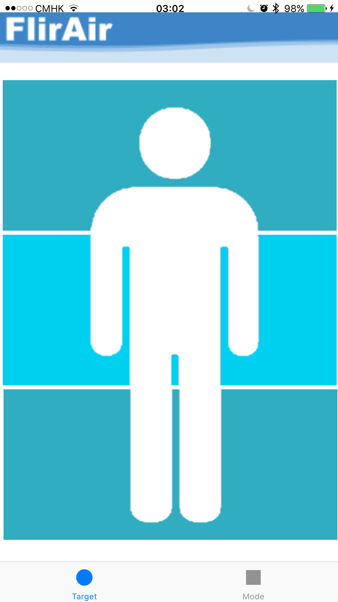

# FlirAir

It is a personal desktop fan with thermal seeking capability, controlled by raspberry Pi and iOS App.
http://devpost.com/software/flirair

## Part list
| Part  | Description / Remark |
| ------------- | ------------- |
| Raspberry Pi  | USD 5-35, depends on model  |
| Male-Male & Male-Female jumper wires  | USD 4-8  |
| Servo X 2  | @USD 3-4  |
| 12V 5V DC 4 pins power supply | 12 V for Fan. 5 V for servo and pi |
| Micro USB Charger (optional) | You can skip this if you provide power from the above power supply |
| PWM PC Chasis Fan | Do not use fan over 1500 RPM. Fan with high RPM is noisy. You can still use a non-PWM fan if you do not want to control fan speed |
| Sticks | for building the frame |

Setup

 

## iOS App

### Screen captures

| Target selection | Mode selection |
| ------------- | ------------- |
|  |  |

### Folder Structure and files

  * Assets, Images for use in App and presentations

  * controller/start_capture.sh, script for run raspberrypi_capture every seconds, and write the captured
    FLIR image to output.pgm

  * controller/raspberrypi_capture, Lepton capture for raspberry pi

  * controller/seek.py, Run contiously to read output.pbm from captured FLIR
    image, and action.txt from httpd.py. Using the information the script
    adjust Fan tilt, rotation and fan speed 

  * controller/httpd.py, HTTP server that receives request from iOS App and
    save the GET parameters to action.txt

  * FlirAir, iOS App with XCode project

  * server/, Server-side code for saving request to action.txt from iOS App

